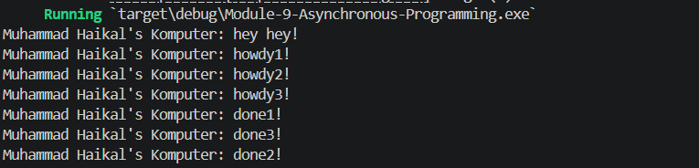

# Module 9 - Asynchronous Programming

## 1.1 Original timer from the book

Perubahan yang dilakukan:
- Mengadopsi kode executor + timer dari Async Book.
- Mengganti teks output dari `Ade's Komputer` menjadi `Muhammad Haikal's Komputer`.

Hasil `cargo run`:

```text
Muhammad Haikal's Komputer: howdy!
...delay 2 detik...
Muhammad Haikal's Komputer: done!
```

## 1.2 Understanding how it works

Perubahan yang dilakukan:
- Menambahkan satu `println!` tepat setelah `spawner.spawn(...)`:
  `Muhammad Haikal's Komputer: hey hey!`

Hasil `cargo run`:


```text
Muhammad Haikal's Komputer: hey hey!
Muhammad Haikal's Komputer: howdy!
...delay 2 detik...
Muhammad Haikal's Komputer: done!
```

Penjelasan:
- `hey hey!` dieksekusi langsung oleh thread `main`, karena berada di luar future async.
- Future di dalam `spawn` baru mulai diproses saat `executor.run()` berjalan.
- Karena itu `hey hey!` selalu muncul lebih dulu, kemudian `howdy!`, lalu setelah timer selesai muncul `done!`.

## 1.3 Multiple spawn and removing drop

Perubahan yang dilakukan:
- Menambahkan 3 task async lewat `spawner.spawn(...)`.
- Masing-masing task mencetak `howdy1/2/3` lalu `done1/2/3` setelah timer 2 detik.

Hasil `cargo run` (dengan `drop(spawner)`):



```text
Muhammad Haikal's Komputer: hey hey!
Muhammad Haikal's Komputer: howdy1!
Muhammad Haikal's Komputer: howdy2!
Muhammad Haikal's Komputer: howdy3!
Muhammad Haikal's Komputer: done1!
Muhammad Haikal's Komputer: done2!
Muhammad Haikal's Komputer: done3!
```

Hasil saat `drop(spawner)` dihapus (dijalankan dengan `timeout 8 cargo run`):

```text
Muhammad Haikal's Komputer: hey hey!
Muhammad Haikal's Komputer: howdy1!
Muhammad Haikal's Komputer: howdy2!
Muhammad Haikal's Komputer: howdy3!
Muhammad Haikal's Komputer: done1!
Muhammad Haikal's Komputer: done3!
Muhammad Haikal's Komputer: done2!
```

Lalu proses tidak selesai (timeout), karena receiver executor masih menunggu channel ditutup.

Penjelasan efek spawn/spawner/executor/drop:
- `spawn` mendaftarkan future sebagai task ke queue.
- `spawner` adalah pengirim task ke queue tersebut.
- `executor` mengambil task dari queue dan mem-poll sampai selesai.
- `drop(spawner)` menutup jalur pengiriman task baru; setelah queue habis, `executor.run()` bisa berhenti.
- Jika `drop(spawner)` tidak dipanggil, queue receiver terus menunggu task baru sehingga program terlihat "hang".

## 2.1 Original code of broadcast chat

Project dikerjakan di folder `chat-async/` dengan dua binary:
- `src/bin/server.rs`
- `src/bin/client.rs`

Cara menjalankan:

```bash
cd chat-async
cargo run --bin server
```

Buka 3 terminal lain untuk client:

```bash
cd chat-async
cargo run --bin client
```

Hasil pengujian (1 server + 3 client):

```text
Server:
listening on port 2000
New connection from 127.0.0.1:52932
New connection from 127.0.0.1:52948
New connection from 127.0.0.1:52952
From client 127.0.0.1:52932: halo dari client1
From client 127.0.0.1:52948: halo dari client2
From client 127.0.0.1:52952: halo dari client3
```

```text
Client 1:
From server: Welcome to chat! Type a message
halo dari client1
From server: halo dari client1
From server: halo dari client2
From server: halo dari client3
```

```text
Client 2:
From server: Welcome to chat! Type a message
From server: halo dari client1
halo dari client2
From server: halo dari client2
From server: halo dari client3
```

```text
Client 3:
From server: Welcome to chat! Type a message
From server: halo dari client1
From server: halo dari client2
halo dari client3
From server: halo dari client3
```

Penjelasan:
- Setiap pesan client dikirim ke server lewat websocket `ws://127.0.0.1:2000`.
- Server broadcast pesan ke semua client yang terhubung.
- Client pengirim juga menerima pesan broadcast-nya sendiri.
