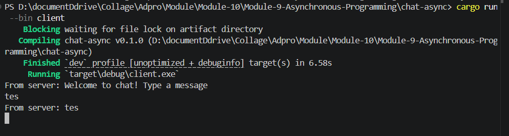
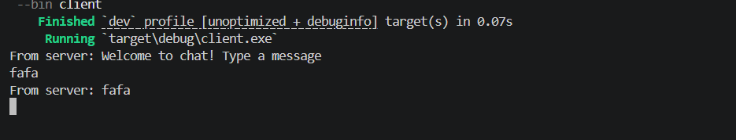
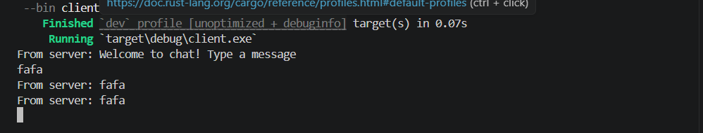
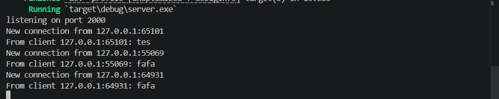
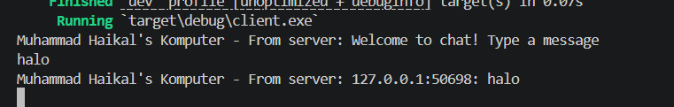
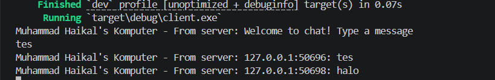
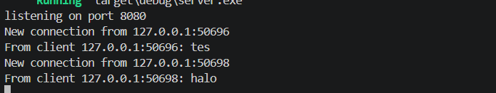

# Module 9 - Asynchronous Programming
`

## 1.1 Original timer from the book


Hasil `cargo run`:

```text
Muhammad Haikal's Komputer: howdy!
...delay 2 detik...
Muhammad Haikal's Komputer: done!
```

## 1.2 Understanding how it works

Perubahan yang dilakukan:
- Menambahkan satu `println!` tepat setelah `spawner.spawn(...)`:
  `Muhammad Haikal's Komputer: hey hey!`

Hasil `cargo run`:


```text
Muhammad Haikal's Komputer: hey hey!
Muhammad Haikal's Komputer: howdy!
...delay 2 detik...
Muhammad Haikal's Komputer: done!
```

Penjelasan:
- `hey hey!` dieksekusi langsung oleh thread `main`, karena berada di luar future async.
- Future di dalam `spawn` baru mulai diproses saat `executor.run()` berjalan.
- Karena itu `hey hey!` selalu muncul lebih dulu, kemudian `howdy!`, lalu setelah timer selesai muncul `done!`.

## 1.3 Multiple spawn and removing drop

Perubahan yang dilakukan:
- Menambahkan 3 task async lewat `spawner.spawn(...)`.
- Masing-masing task mencetak `howdy1/2/3` lalu `done1/2/3` setelah timer 2 detik.

Hasil `cargo run` (dengan `drop(spawner)`):


```text
Muhammad Haikal's Komputer: hey hey!
Muhammad Haikal's Komputer: howdy1!
Muhammad Haikal's Komputer: howdy2!
Muhammad Haikal's Komputer: howdy3!
Muhammad Haikal's Komputer: done1!
Muhammad Haikal's Komputer: done2!
Muhammad Haikal's Komputer: done3!
```

Hasil saat `drop(spawner)` dihapus (dijalankan dengan `timeout 8 cargo run`):

```text
Muhammad Haikal's Komputer: hey hey!
Muhammad Haikal's Komputer: howdy1!
Muhammad Haikal's Komputer: howdy2!
Muhammad Haikal's Komputer: howdy3!
Muhammad Haikal's Komputer: done1!
Muhammad Haikal's Komputer: done3!
Muhammad Haikal's Komputer: done2!
```

Lalu proses tidak selesai (timeout), karena receiver executor masih menunggu channel ditutup.

Penjelasan efek spawn/spawner/executor/drop:
- `spawn` mendaftarkan future sebagai task ke queue.
- `spawner` adalah pengirim task ke queue tersebut.
- `executor` mengambil task dari queue dan mem-poll sampai selesai.
- `drop(spawner)` menutup jalur pengiriman task baru; setelah queue habis, `executor.run()` bisa berhenti.
- Jika `drop(spawner)` tidak dipanggil, queue receiver terus menunggu task baru sehingga program terlihat "hang".

## 2.1 Original code of broadcast chat

Project dikerjakan di folder `tutorial-broadcast-chat/` dengan dua binary:
- `src/bin/server.rs`
- `src/bin/client.rs`

Cara menjalankan:

```bash
cd tutorial-broadcast-chat
cargo run --bin server
```

Buka 3 terminal lain untuk client:

```bash
cd tutorial-broadcast-chat
cargo run --bin client
```

Hasil pengujian (1 server + 3 client):

Client 1:



Client 2:



Client 3:




Server:


Penjelasan:
- Setiap pesan client dikirim ke server lewat websocket `ws://127.0.0.1:2000`.
- Server broadcast pesan ke semua client yang terhubung.
- Client pengirim juga menerima pesan broadcast-nya sendiri.

## 2.2 Modifying the websocket port

Perubahan:
- `tutorial-broadcast-chat/src/bin/server.rs`: bind dari `127.0.0.1:2000` menjadi `127.0.0.1:8080`.
- `tutorial-broadcast-chat/src/bin/client.rs`: URI websocket dari `ws://127.0.0.1:2000` menjadi `ws://127.0.0.1:8080`.

Hasil pengujian:

```text
Server:
listening on port 8080
New connection from 127.0.0.1:45544
From client 127.0.0.1:45544: test 8080
```

```text
Client:
From server: Welcome to chat! Type a message
test 8080
From server: test 8080
```

Penjelasan protocol:
- Protocol websocket tetap `ws`.
- Definisinya ada di URI client: `ws://127.0.0.1:8080`.
- Sisi server tidak menuliskan `ws://`, tapi tetap websocket karena koneksi dibungkus oleh `ServerBuilder::new().accept(socket)`.

## 2.3 Small changes, add some information to client

Perubahan:
- Server sekarang broadcast dengan format `IP:port: pesan` agar penerima tahu asal pesan.
- Client mengubah tampilan output menjadi:
  `Muhammad Haikal's Komputer - From server: ...`

Contoh hasil:

Client 1:



Client 2:



Server:



Penjelasan:
- Informasi pengirim diambil dari `SocketAddr` koneksi client di server.
- Setiap kali server menerima pesan, server menambahkan `IP:port` pengirim sebelum broadcast.
- Dengan format ini, semua client bisa membedakan asal setiap pesan tanpa fitur username.

## 3.1 Original code (WebChat using Yew)

Project tutorial 3 ada di folder:
- `tutorial-webchat-yew/simple-websocket-server`
- `tutorial-webchat-yew/yewchat-client`

Source mengikuti referensi blog + repo aslinya (server websocket Node + client Yew).

Penyesuaian kompatibilitas yang diperlukan:
- Versi `wasm-bindgen`, `web-sys`, dan `wasm-bindgen-futures` di client dinaikkan supaya bisa build di toolchain Rust terbaru.
- `webpack.config.js` disesuaikan agar output wasm cocok dengan import `bootstrap.js`.

Cara run (contoh port yang bebas bentrok):

1) Terminal server:
```bash
cd tutorial-webchat-yew/simple-websocket-server
PORT=18080 npm start
```

2) Terminal client:
```bash
cd tutorial-webchat-yew/yewchat-client
wasm-pack build --target web --out-name index --out-dir pkg -- --features wee_alloc
PORT=18003 npm start
```

3) Buka browser:
- `http://localhost:18003/?ws=127.0.0.1:18080`

Hasil verifikasi di environment ini:
- `simple-websocket-server`: sukses start (listening pada port custom).
- `yewchat-client`: sukses compile (`webpack compiled successfully`) pada port custom.

## 3.2 Add some creativities to the webclient

Perubahan kreatif yang ditambahkan pada client Yew:
- Menambah halaman baru `About` (`/about`) berisi ringkasan fitur dan eksplorasi.
- Menambah tombol akses `See Creative Notes` pada halaman login.
- Menambah panel info di halaman chat:
  - username aktif
  - jumlah user online
  - jumlah message saat ini
  - tombol `Clear` untuk membersihkan message lokal
- Menambah quick-message buttons:
  - `Hello`
  - `Rust`
  - `GIF`
- Menambah fallback avatar agar UI tidak panic ketika user pengirim belum terpetakan.
- Membuat websocket endpoint di client lebih fleksibel lewat query param:
  - `?ws=127.0.0.1:18080`

File utama yang diubah:
- `tutorial-webchat-yew/yewchat-client/src/lib.rs`
- `tutorial-webchat-yew/yewchat-client/src/components/login.rs`
- `tutorial-webchat-yew/yewchat-client/src/components/chat.rs`
- `tutorial-webchat-yew/yewchat-client/src/components/about.rs` (baru)
- `tutorial-webchat-yew/yewchat-client/src/services/websocket.rs`
